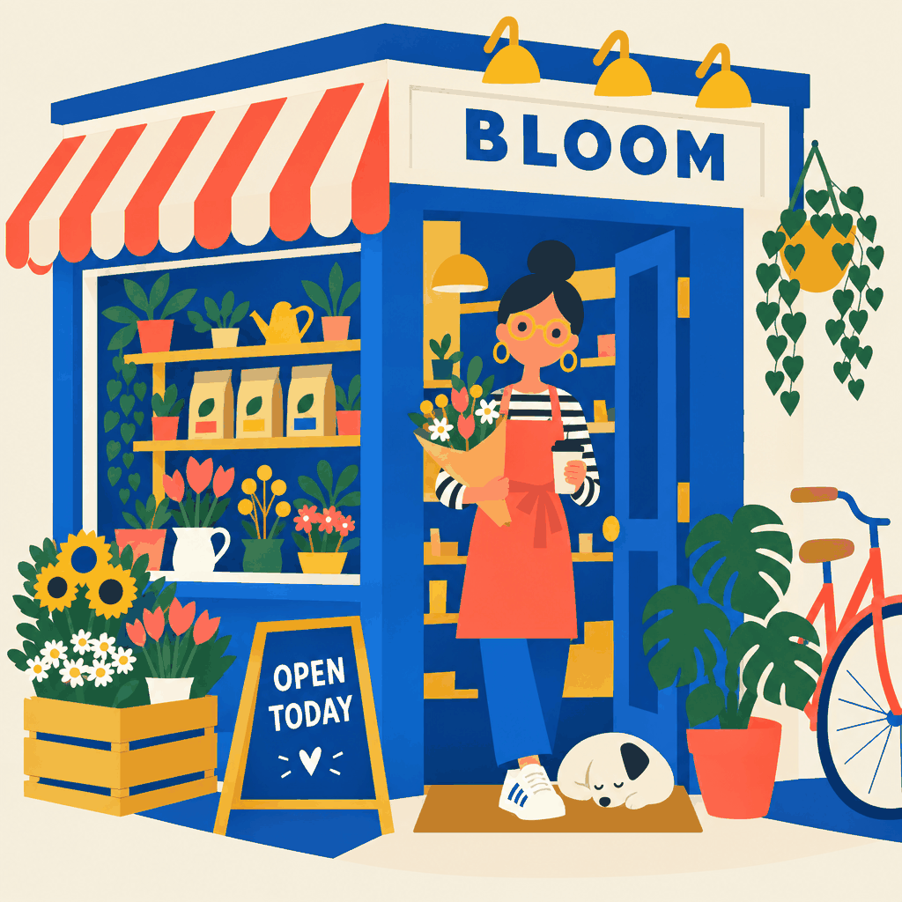
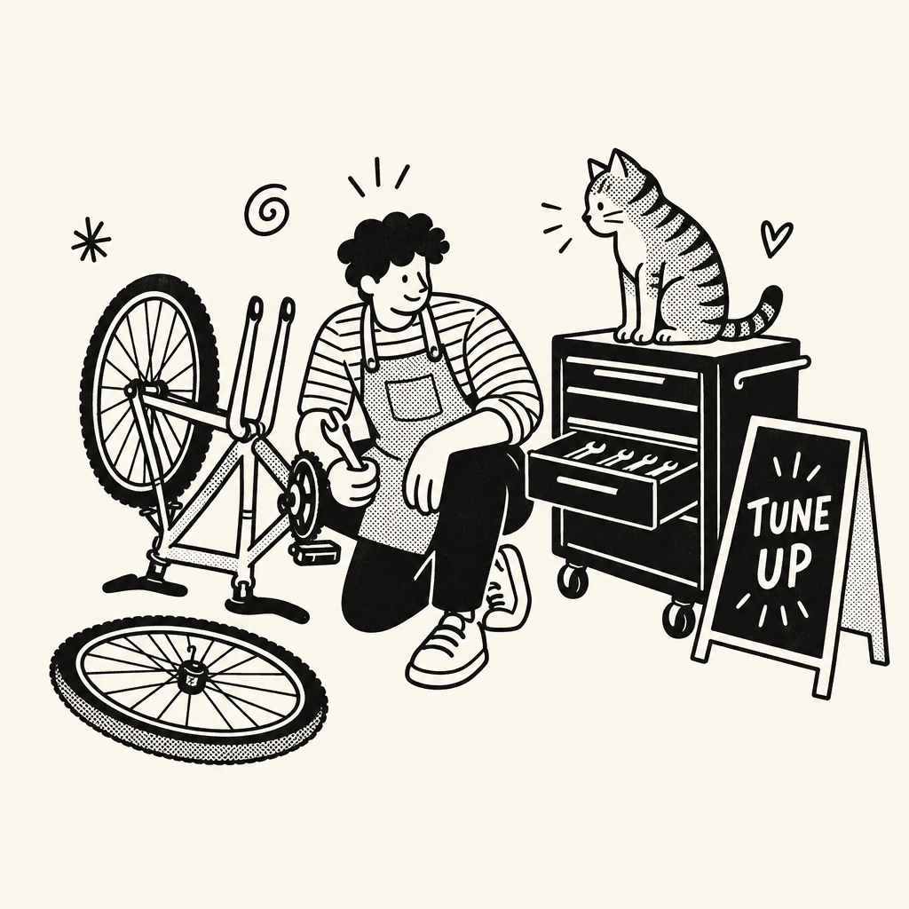
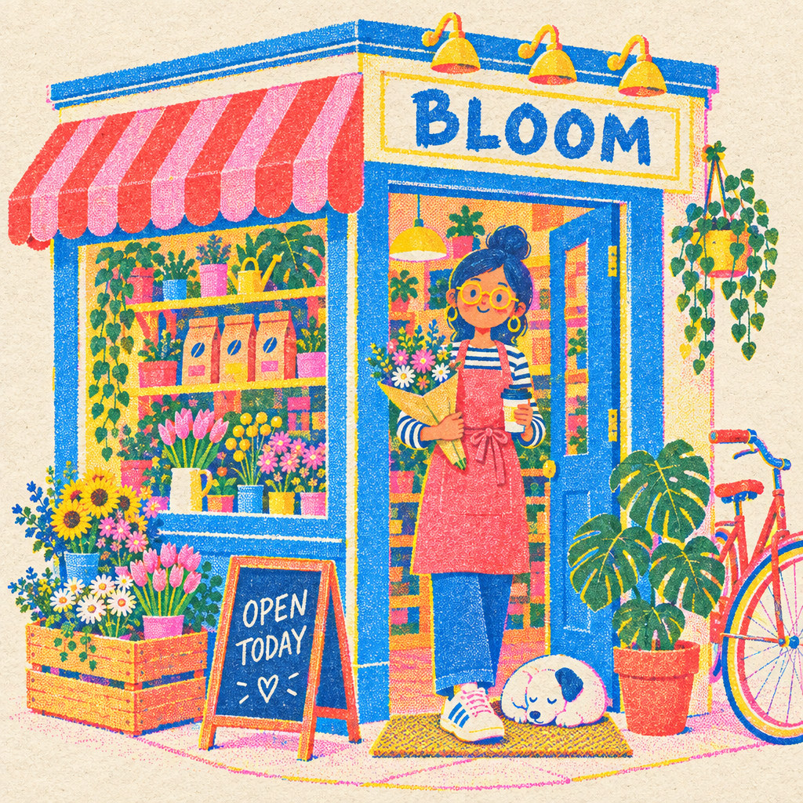
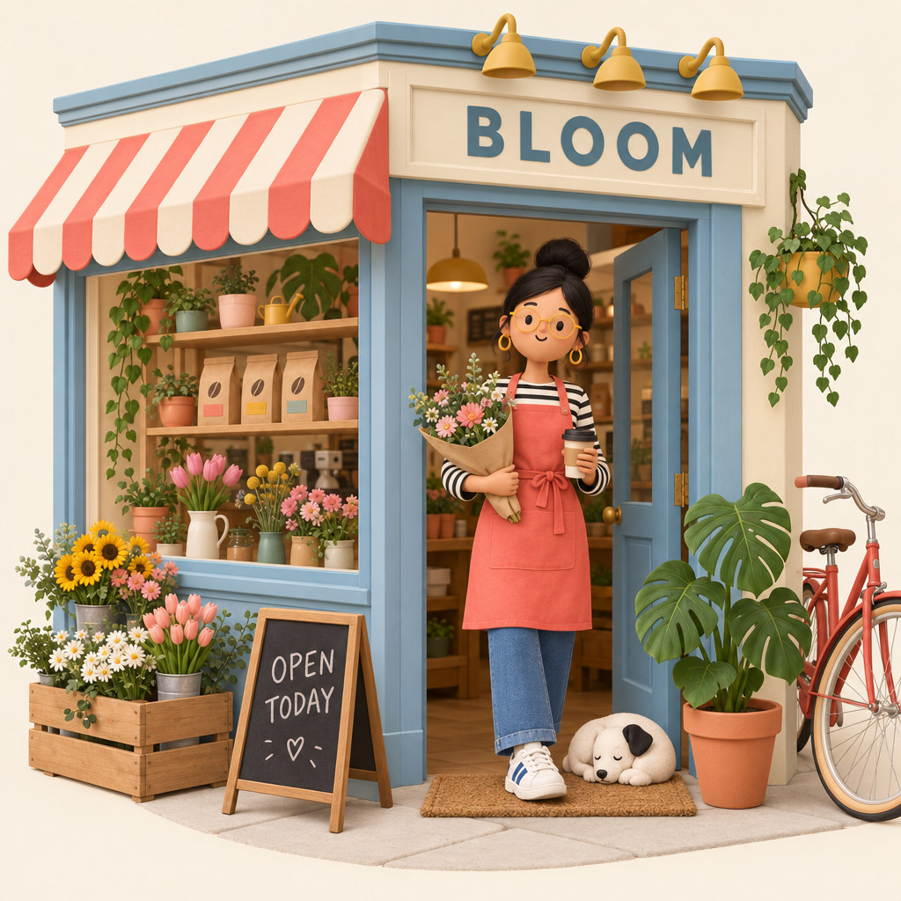
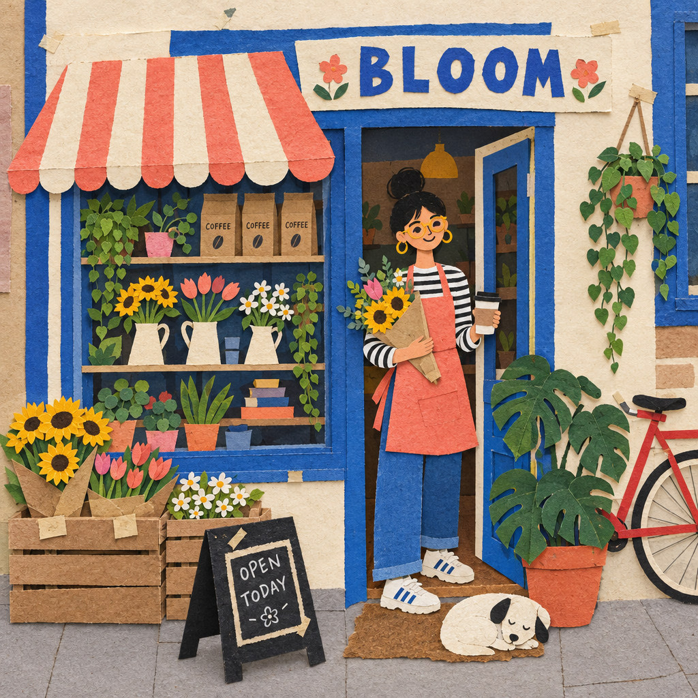
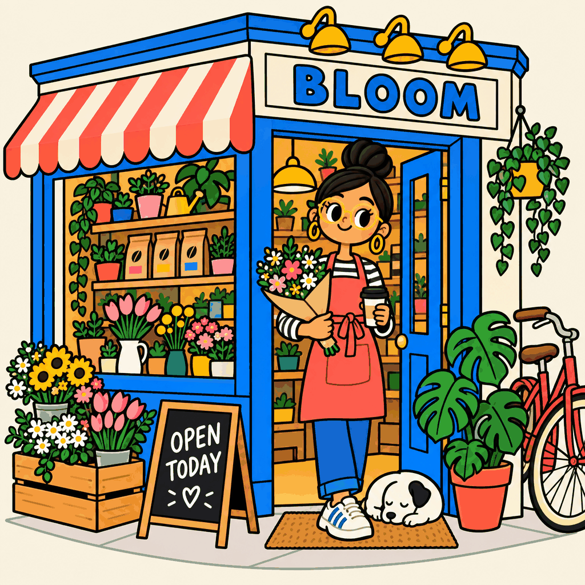
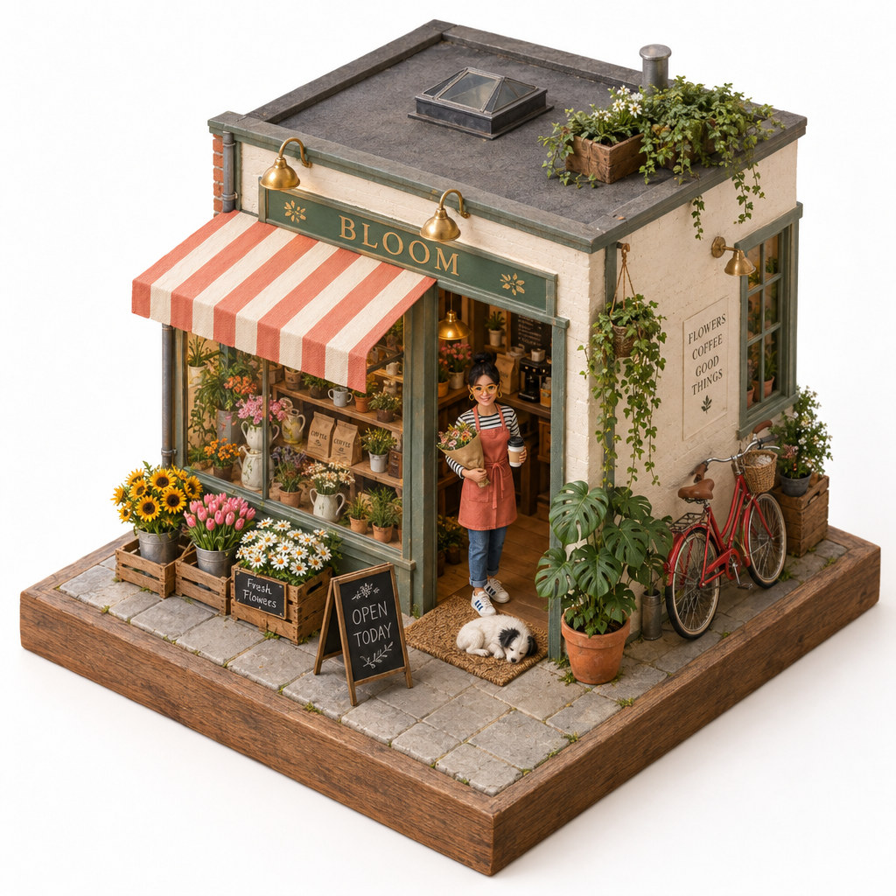
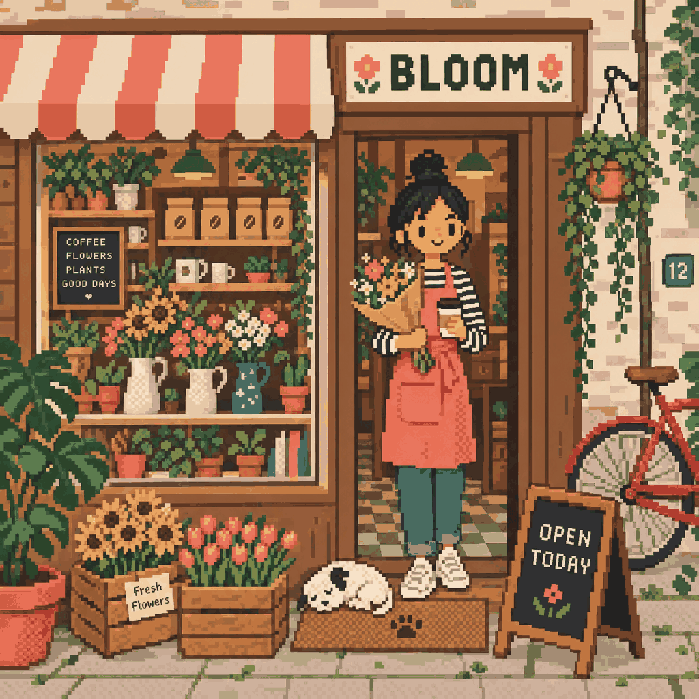

# 🎨 imagegen

A Claude skill for making images with [fal.ai](https://fal.ai). Illustrations, icons, mockups,
placeholders, product shots, transparent cutouts, contact sheets — all the everyday asset stuff
you'd rather not leave your editor for. ✨

It's opinionated, and that's the whole point. The skill never picks for you behind your back. It
asks which model, which ratio, and whether you want the background gone — with the price of every
option on the table — before it spends a single cent. 💸

## 🚀 Quick start

Three steps, about a minute. ⏱️

**1. Install it** — in Claude Code:

```bash
git clone https://github.com/guillaumesimon/imagegen-skill ~/.claude/skills/imagegen
```

**2. Give it a key** — grab one from [fal.ai](https://fal.ai/dashboard/keys), pay per image,
no subscription:

```bash
export FAL_KEY="your-key"
```

**3. Restart Claude Code, then just ask:**

```
Generate a hero image for the landing page, abstract gradient, dark theme
```

It asks which model, which ratio, and whether you want the background gone — every price on
the table — then generates, saves the file and tells you what it cost. That's the whole loop. 🔁

Three characters and eleven styles ship with it, so you can also try:

```
Fais une image de Momo sur un skateboard
```

Using the Chat tab, Cowork or claude.ai? Keeping the key out of your shell profile? Both are
covered in [Install](#-install) and [Your key](#-your-key) further down. 👇

## 🧰 What you get

### 🪜 A five-rung model ladder

Same order every time, prices always visible, the cheap one is the default.

| # | Model | Price per image | Reach for it when |
|---|---|---|---|
| 1 | 🐣 Muse Image (Meta) | $0.01 | Default. Fast, cheap, weirdly good at text, charts and QR codes inside the image |
| 2 | 🍌 Nano Banana 2 (Google) | $0.08 at 1K → $0.16 at 4K | Photoreal detail, busy composition, or you just want 4K |
| 3 | 🤖 Grok Imagine Pro (xAI) | $0.05 at 1k, $0.07 at 2k | A different look, or very wide ratios |
| 4 | 👑 GPT Image 2.5 Flare (OpenAI) | $0.053 at `high`, $0.006 → $0.21 across the slider | It has to be right the first time. Tops both arena leaderboards, does transparent natively, eats 16 reference images |
| 5 | 🖨️ Reve 2.1 | $0.25 flat | Poster-size, native 4K, and the best in-image typography of the bunch |

Rungs 1–3 are the everyday ladder. 4 and 5 are the premium tier — the skill won't push them on
you unless the job actually calls for it. 🙅

### 🖼️ Text to image, and image to image

Up to 16 reference images depending on the model. Local files go inline as data URLs, so nothing
gets shoved into some bucket first. On Reve you can even point at a specific reference from the
prompt with `<frame>1</frame>` — handy for "the jacket from frame 1 on the model in frame 2". 🧥

### ✂️ Background removal, two ways

Ask for a cutout and you get one:

- 🆓 **GPT Image 2.5** does it natively (`background: "transparent"`). No second call, no extra
  cost, and hair and thin edges survive way better.
- 🩹 **Everything else** goes through Bria RMBG 2.0 (+$0.018). The version *with* the background
  gets saved right next to it, so a bad matte doesn't mean paying for the generation twice.

### 🧩 Contact sheets that actually work

Ask for a grid, a character sheet or a turnaround and you get **one** generated image whose prompt
describes the grid. Not nine images glued together. 🚫🪡

Stitched cells drift — different face, different proportions, different light — which defeats the
entire reason you wanted a sheet. One generation, one consistent subject.

### 🎭 A library of characters and styles

Two folders inside the skill, one Markdown file per entry:

```
characters/momo/CHARACTER.md    styles/playful-geometric/STYLE.md
characters/ines/CHARACTER.md    styles/clever-doodle/STYLE.md
characters/malik/CHARACTER.md   styles/happy-riso/STYLE.md
                                styles/editorial-3d/STYLE.md
                                ... eleven in all
```

A **character** is an identity: a short description plus three to six *locked traits* copied
word for word into every prompt. Not "brown hair" — "blunt bob at the jawline with a straight
fringe". That's what survives from one generation to the next. 🔒

A **style** is a rendering: medium, palette, light, plus an `Avoid:` line that goes in as
negative guidance. Eleven ship in the box, eight of them with a reference image: 🖌️

| | Style | What it is |
|---|---|---|
|  | `playful-geometric` | Flat geometric shapes, no outlines at all, poster calm |
|  | `clever-doodle` | Confident brush line on empty cream, solid blacks, halftone dots, hand lettering |
|  | `happy-riso` | Risograph, four inks, grain and deliberate misregistration |
|  | `editorial-3d` | Matte clay editorial 3D, whole scenes, soft diffuse light |
|  | `cut-paste` | Layered cut paper photographed flat, real physical shadows |
|  | `new-school-cartoon` | Thick black outlines, saturated flats, retro mascot energy |
|  | `realistic-isometric` | Isometric miniature on a slab, credible materials, premium |
|  | `cozy-pixel` | Warm muted pixel art, indie-game daily life |
| *no reference* | `soft-clay` | Matte clay 3D too, but one hero character on a plain backdrop |
| *no reference* | `megadrive` | 16-bit pixel art, saturated, high contrast, dark outlines |
| *no reference* | `dreamlike` | Pastel editorial illustration running on dream logic |

Two pairs sit deliberately close: `editorial-3d` and `soft-clay` are both matte clay, one for a
whole scene and one for a single character; `cozy-pixel` and `megadrive` are both pixel art, one
warm and quiet, one loud. Pick by what the image has to do, not just by the medium. 🎚️

A style reference is there for the *rendering* only — the line, the palette, the texture, the
light — and the prompt has to say so, or the reference's own subject and composition come along
for the ride. Each one is a single image, kept at 1024px and recompressed, so all eight together
add about 3 MB to the bundle. 🧷

The eight come from a reference pack of eight illustration territories, each declined across
the same five scenes; `clever-doodle` was then reworked against a product-brand illustration
register. Four of them — `realistic-isometric`, `clever-doodle`, `cut-paste`, `cozy-pixel` —
were tested by generating from the text alone with no reference attached, which is the only way
to find out whether a `STYLE.md` actually stands up. Two needed fixing after that. The other
four (`playful-geometric`, `happy-riso`, `editorial-3d`, `new-school-cartoon`) are written to
the same spec but have not been through that loop yet. 🧪

They're two axes, so they compose. 🎲 Momo the bulldog in `megadrive`, Momo in `dreamlike`,
Inès in `soft-clay` — any character, any style. The ones shipped in the repo are real working
examples, and they're also a template: copy a folder, rewrite the description.

Nothing is ever applied behind your back. Name a character and the skill asks whether you meant
*that* one, then asks which style — offering the character's own first, since that's the pairing
that reproduces best. ✅

Because the library lives **inside the skill folder**, it travels with it: same entries in Claude
Code, in the desktop app, in Cowork, on claude.ai. One caveat, stated plainly — only Claude Code
can *write* new entries. Elsewhere the bundle is read-only, so a new character means re-zipping
and re-uploading. 📦

### 🛡️ Format checked before you pay

Aspect ratio support isn't the same across models, and GPT Image 2.5 doesn't even speak
`aspect_ratio` — it wants named `image_size` values. The skill validates your pick against the
model you chose and offers the nearest supported value, instead of eating a 422 or quietly
falling back to something you never asked for. 🎯

## ✅ Before you start

- A [fal.ai API key](https://fal.ai/dashboard/keys). Pay per image, no subscription. Figure one cent
  for a quick Muse draft, twenty-five for a Reve poster. 🪙
- `curl` and `python3`. Both already on macOS and basically every Linux box.
- Real network access. Sandboxes that block `fal.run` can't run this, no matter how valid your key
  is. 🚧

## 📦 Install

### Claude Code

```bash
git clone https://github.com/guillaumesimon/imagegen-skill ~/.claude/skills/imagegen
```

Already keep the repo somewhere else? Only one file matters:

```bash
mkdir -p ~/.claude/skills/imagegen
cp SKILL.md ~/.claude/skills/imagegen/SKILL.md
```

Restart Claude Code — skills are read at startup. 🔄

Want it in one project only instead of everywhere? Use `<project>/.claude/skills/imagegen/`.

### Claude desktop app (Chat tab), Cowork, claude.ai

Zip the **whole folder** and upload it as an account skill from the skills panel in settings:

```bash
cd imagegen-skill && zip -r imagegen.zip SKILL.md characters styles
```

The folder, not just `SKILL.md` — the `characters/` and `styles/` library only comes along if
you bundle it. 🎁

The desktop app is both worlds at once, and that trips people up: its **Code** tab is Claude
Code and reads `~/.claude/skills/`, its **Chat** tab uses account skills. Installing in one does
not install in the other. 🚪🚪

⚠️ Heads up: account skills and Claude Code's local skills directory are two separate worlds.
Installing in one doesn't install in the other. Use both? Install in both.

## 🔑 Your key

Three sources, checked in this order. The skill only bothers you if all three come up empty.

**1. Environment variable** 🌍 — works anywhere:

```bash
export FAL_KEY="your-key"   # ~/.zshrc, ~/.bashrc, or a project .env
```

**2. macOS Keychain** 🔐 — nothing in plain text on disk, nothing in your shell history:

```bash
security add-generic-password -U -s fal.ai -a FAL_KEY -w
```

It prompts for the value and echoes nothing back. Check it landed:

```bash
security find-generic-password -s fal.ai -a FAL_KEY -w
```

**3. Straight in the skill file** 📌 — the escape hatch, and it's there on purpose. A
GUI-launched Claude, Cowork, claude.ai or a scheduled run can reach the skill with no shell
profile and no Keychain, and then the key written into `SKILL.md` is the only thing that makes
it work. Section 1 of the skill ends with an empty line waiting for it:

```bash
FAL_KEY="${FAL_KEY:-}"   # embedded fallback — paste the key between the braces
```

Fill that in on your **installed** copy and lock it down:

```bash
chmod 600 ~/.claude/skills/imagegen/SKILL.md
```

🚨 One rule, and it's the whole reason the line ships empty: **never fill it in on a copy that
lives in a git repo.** `SKILL.md` is plain text — it gets committed, pushed, forked and pasted
into issues. A key in a repo is a published key, and fal will happily bill whoever finds it.
Installed copy: fine. This repo: empty. 🙅

## 💬 Using it

Just ask. The skill picks up on requests for images, illustrations, icons, mockups, assets,
cutouts and sheets.

```
Generate a hero image for the landing page, abstract gradient, dark theme
```

It'll ask for the model, the ratio and the background treatment, then the quality tier if your
model has one, then generate and tell you the path, the settings and what it cost.

A few more:

```
Make me an app icon, minimalist, gradient blue background with a white geometric shape
```

```
Take public/references/bottle.png and restyle it as a studio product shot on white
```

```
I need a contact sheet, 3x3, of nine poses of the same character
```

```
Generate a product photo of the sneaker and cut out the background
```

```
Design an A2 event poster, heavy typography, with Reve
```

From the library — the skill confirms the character, then asks which style: 🎭

```
Fais une image de Momo sur un skateboard
```

```
Inès in soft-clay style, waving, on a plain background
```

Spell it out up front and it skips the questions entirely: ⚡

```
Generate a 16:9 banner with GPT Image 2.5 at high, keep the background
```

## ➕ Adding a character or a style

Two ways in, same destination. Ask the skill to do it, or write the files yourself. 🛤️

### 🗣️ The fast way — just ask

```
Crée un personnage à partir de cette description : une renarde bibliothécaire, 
lunettes en demi-lune, gilet en tweed
```

The skill runs the whole flow: it asks the usual questions, generates the sheet, writes the
file, and tests the result. Nothing is spent before you've answered. Works in Claude Code,
where the folder is writable.

### 🧍 Adding a character by hand — 5 steps

**1. Make the folder.**

```bash
mkdir -p characters/nina/refs
```

The folder name is the slug: lowercase, no spaces, no accents. It's what you'll type to
summon them. 🏷️

**2. Get a reference sheet.**

One image, several views, one call — never stitch separate generations together, they drift.
Ask for a 6-cell grid: front, three-quarter, profile, back, and two head close-ups with
different expressions. Save it as `characters/nina/refs/sheet.png`.

**3. Write `CHARACTER.md`.**

```markdown
---
name: nina
kind: character
refs: [refs/sheet.png]
ref_style: soft-clay
locked:
  - half-moon glasses pushed down the muzzle
  - rust-red tweed waistcoat with brass buttons
  - white tuft on the left ear
---

Nina is a red fox in her forties, small and precise in her movements...
```

`ref_style` records the style the *sheet* is drawn in. It can name a style that isn't in your
library — that's fine and expected. It's what lets the skill know it has to override the
reference's rendering when you ask for a different style. 🎨

**4. Choose the locked traits.** This is the step that decides everything. 🔒

Three to six, no more. A trait earns its place if it's **discriminative** and **easy to say**.
Generic adjectives produce a different character every time:

| ❌ Worthless | ✅ Reproduces |
|---|---|
| brown hair | blunt bob at the jawline, straight fringe |
| wears glasses | round glasses, thin gold wire frames |
| blue jacket | cobalt blue chore jacket over a plain white tee |
| cute dog | right ear straight up, left ear folded forward |

One trap worth naming: **don't put the style in the character.** "Cute pixel-art bulldog" welds
the two axes together and you'll never get that dog in watercolour. The character is who they
are; the style is how they're drawn. Keep them apart. ✂️

**5. Test it before you trust it.** 🧪

Regenerate the character in a pose that is **not** on the sheet. If the identity holds, the
entry is real. If it drifts, your locked traits are too vague — rewrite them and go again.

This is the step everyone skips, and it's the only one that tells you whether the entry is
worth anything. An entry that doesn't reproduce is worse than no entry at all, because you'll
trust it. 🕳️

### 🎨 Adding a style — 2 steps

Simpler, and free: a style needs no image at all.

```bash
mkdir -p styles/blueprint
```

```markdown
---
name: blueprint
kind: style
refs: []
---

Architectural cyanotype: chalk-white line work on a deep Prussian blue ground,
everything drafted at constant thin weight with visible construction lines,
dimension arrows and a hand-lettered title block in the corner...

Avoid: colour, filled areas, soft shading, photographic detail, perspective
blur.

Production notes. The blue ground has to be named as a flat fill or the model
reads "cyanotype" as a photographic process and returns a blurry scan.
```

Cover four things — **medium, palette, light, level of detail** — then close with the `Avoid:`
line. That line is passed in as negative guidance and it does real work: it's what stops a
style from sliding back toward generic. 🚧

**Write for the image model, not about it.** Everything above the `Avoid:` line gets pasted
into the prompt more or less as-is, so keep it descriptive. The moment you write "tell the model
to…" or "otherwise it tends to…", you've written a note to whoever composes the prompt — and a
prompt that describes the model's own failure modes is a prompt the model tries to draw. Those
belong in an optional **`Production notes.`** paragraph after the `Avoid:` line, which the skill
reads and acts on but never sends. 📝

It's worth having. Two of the shipped styles need it: `realistic-isometric` has to be told its
camera every single time, because that never survives a reference image, and `clever-doodle` has
to keep its accent colour opt-in or the model spends it decorating the nearest prop. 🎯

Want a reference image too? Drop one in `styles/blueprint/refs/` and list it under `refs:`.
Keep it to a single image: one character ref plus one style ref is two slots, which fits inside
every model in the catalogue, Grok's three included. 🎰

One finished image in the style is the right reference — and say in the prompt that it's there
for the rendering only, or its subject and composition tag along. That's how the eight shipped
style references are wired. 🧷

### 📤 Making it available everywhere

Claude Code reads the folder at startup, so restart it and the new entry is live. For the
desktop app's Chat tab, Cowork or claude.ai, re-zip and re-upload:

```bash
zip -r imagegen.zip SKILL.md characters styles
```

Entries you add are untracked files in the clone, so `git pull` will never touch them. If you
push a fork and would rather keep your characters private, add `characters/` and `styles/` to
`.gitignore`. 🔐

## 💰 What it costs

Per output image, before resolution multipliers:

- 🐣 Muse Image: $0.01
- 🍌 Nano Banana 2: $0.08 at 1K. Multipliers: 0.5K ×0.75, 2K ×1.5, 4K ×2
- 🤖 Grok Imagine Pro: $0.05 at 1k, $0.07 at 2k, plus $0.01 per input image when editing
- 👑 GPT Image 2.5 Flare at 1024²: `low` $0.006, `medium` $0.013, `high` $0.053, `xhigh` $0.094,
  `max` $0.21. At 4K: $0.011 / $0.026 / $0.10 / $0.18 / $0.40. Edits bill the input images and a
  long prompt on top.
- 🖨️ Reve 2.1: $0.25, one price, always native 4K
- ✂️ Bria background removal: $0.018 (free on GPT Image 2.5, which does it itself)

Fun fact: GPT Image 2.5 at its default `high` costs **less** than Nano Banana 2 at 1K while sitting
above it on both leaderboards. The scary $0.21 number is the `max` tier. 🤯

A contact sheet is one image, so it costs the same as a single generation no matter how many cells.
Resolution matters more on a sheet though — each cell only gets a slice of the pixels. 🔍

## 🚧 Known limits

- Images only, no video. 🎥❌
- Background removal handles one subject per image, so it can't cut out each cell of a contact
  sheet separately — native transparent mode included.
- Past roughly 12 cells, per-cell detail on a sheet falls apart.
- Muse Image and Reve 2.1 have no resolution control. Muse is therefore a bad pick for dense
  sheets; Reve is the opposite problem, you pay for 4K whether you need it or not.
- Reve is a text-to-image pick. It ranks below Nano Banana 2 at editing, so don't reach for it to
  retouch things.
- Character identity is never pixel-perfect across generations. Locked traits and a reference
  sheet get you a long way, but a face will shift a little from one image to the next. Plan on
  it, especially at small sizes and in styles that simplify features away.
- Clickable answers are a Claude Code feature. In Chat, Cowork and on claude.ai a skill can
  only emit text, so the same questions arrive one per message, answered by typing a number.
  Same questions, same order, one more keystroke each. ⌨️
- Only Claude Code can write new library entries. In the desktop app's Chat tab, in Cowork and
  on claude.ai the skill bundle is read-only: entries work, but adding one means re-zipping and
  re-uploading the folder yourself.
- Prices and endpoint names come from fal.ai and they move. If a parameter that used to work starts
  throwing 422, check the model pages. 📉

## 🛠️ Making it yours

`SKILL.md` is the skill itself — one file, plain Markdown — and `characters/` plus `styles/`
are the library beside it. Sensible things to tweak:

- Swap models or reorder the ladder in section 3, then fix the price tables in sections 3, 4 and 5
  to match.
- Delete the mandatory questions in section 4 if you'd rather it just decided. That single change
  does the most to alter how the skill feels. 🎚️
- Replace the default aspect ratio options with the ones you actually use.
- Point the background removal step at a different matting model in section 9.
- Delete the shipped characters and styles once you have your own. They're examples, not
  furniture. 🪑

## 🙏 Credits

Models are served by [fal.ai](https://fal.ai): Muse Image by Meta, Nano Banana 2 by Google, Grok
Imagine by xAI, GPT Image 2.5 by OpenAI, Reve 2.1 by Reve, RMBG 2.0 by Bria. This repo is just the
skill definition.

Built by [Guillaume Simon](https://guillaumesimon.app). 👋
